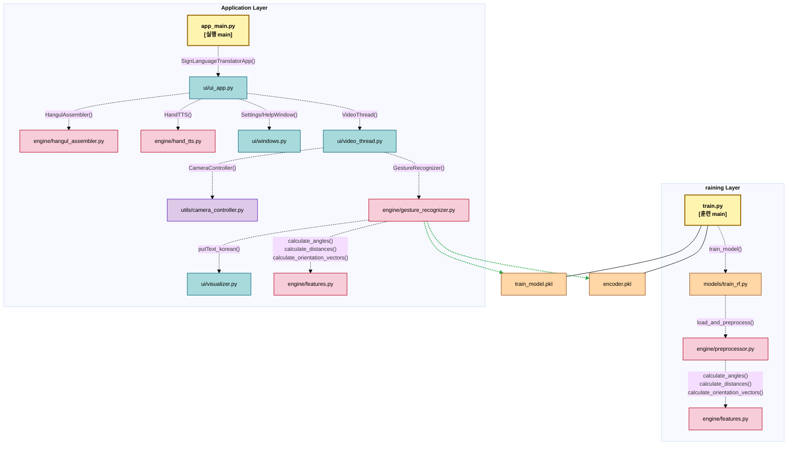

# <span style="color:#97BC62; background-color:#2C5F2D">실시간 수어 번역 프로그램 (Real-time Sign Language Translator)

> 웹캠을 통해 실시간으로 사용자의 **`손 모양`을 인식**하여 **`텍스트`로 변환**하고, 완성된 단어/문장을 **`음성`으로 출력**하는 머신러닝 기반의 데스크톱 애플리케이션입니다.

<br>


## <span style="color:#f400fe; background-color:#5e00bc">주요 기능 (Key Features)

* <span style="color:#3daeff; background-color:#00366b">**실시간 손 인식**</span>: `Mediapipe`를 활용하여 웹캠 영상에서 실시간으로 손의 랜드마크를 정확하게 감지합니다.
* <span style="color:#3daeff; background-color:#00366b">**머신러닝 기반 번역**</span>: Scikit-learn의 `RandomForest` 모델을 사용하여 40여 개의 한글 자모 및 제어 명령 제스처를 분류합니다.
* <span style="color:#3daeff; background-color:#00366b">**실시간 한글 조합**</span>: 인식된 자모음을 즉시 조합하여 완성형 한글 문장을 생성합니다.
* <span style="color:#3daeff; background-color:#00366b">**음성 출력 (TTS)**</span>: 문장 완성을 의미하는 'end' 제스처 시, `gTTS`를 통해 완성된 문장을 음성으로 읽어줍니다.
* <span style="color:#3daeff; background-color:#00366b">**사용자 설정**</span>: 인식 속도, 랜드마크 표시 여부, TTS 볼륨 등 사용자가 직접 프로그램의 동작을 설정할 수 있습니다.

<br>

## <span style="color:#f400fe; background-color:#5e00bc">시스템 아키텍처 (System Architecture)

본 애플리케이션은 `UI 스레드`와 `AI 연산 스레드`를 분리한 <span style="color:#dca400; background-color:#44270e">멀티스레드 구조</span>로 설계되었습니다. 이 구조 덕분에 무거운 실시간 영상 처리와 AI 추론 중에도 **UI가 멈추지 않고 부드럽게 반응**합니다.




<br>

## <span style="color:#f400fe; background-color:#5e00bc">파일 구조 (File Structure)

프로젝트는 기능별로 명확하게 역할을 분리하여 <span style="color:#dca400; background-color:#44270e">모듈성</span>과 <span style="color:#dca400; background-color:#44270e">유지보수성</span>을 높였습니다.

```
.
├── app_main.py                   # 애플리케이션 실행부
├── train.py                      # 모델 훈련부
├── requirements.txt              # 프로젝트 의존성 목록(필요한 라이브러리 목록)
│
├── config/                       # 설정, 경로, 상수 등 전역 데이터 관리
│   ├── dictionary_kr.py          # 언어 관련 상수 정의
│   ├── paths.py                  # 데이터셋, 모델, 폰트, 이미지 등 주요 파일 및 폴더 경로 정의
│   └── settings.py               # 카메라 설정, 인식 속도, 신뢰도 임계값 등 설정값 정의
│
├── data/                         # 학습용 데이터셋, 폰트, 이미지 등 리소스
│   ├── 세종머왕.png                # 아이콘 이미지
│   ├── hand_img.png              # 도움말 이미지
│   ├── GowunDodum-Regular.ttf    # 한글 폰트
│   └── combine_4.csv           
│
├── engine/                       # 핵심 로직 (AI 추론, 한글 조합, TTS)
│   ├── features.py               # 특징 (각 랜드마크) 계산
│   ├── gesture_recognizer.py     # 모델을 통해 제스처를 예측 (+ 인식 안정화)
│   ├── hangul_assembler.py       # 실시간으로 한글 글자를 조합 (조합 규칙 관리)
│   ├── hand_tts.py               # 텍스트를 음성으로 변환
│   └── preprocessor.py           # 전체 데이터를 훈련 가능한 특징 벡터로 변환
│
├── models/                       # 훈련된 모델(.pkl)이 저장되는 곳
│   └── train_rf.py               # 랜덤 포레스트 학습 모델
│
├── ui/                           # UI 관련 코드 (메인 창, 스레드, 시각화)
│   ├── ui_app.py                 # 메인 UI 창을 생성하고 관리
│   ├── video_thread.py           # 영상 처리와 제스처 인식 등의 작업을 스레드에서 처리
│   ├── visualizer.py             # OpenCV 이미지 위에 한글 텍스트를 시각화
│   └── windows.py                # 도움말, 설정 등의 보조 창을 정의
│
└── utils/                        # 보조 기능 (카메라 제어, 설치 스크립트)
    ├── camera_controller.py      # 카메라 제어
    └── installer.py              # 필요한 라이브러리를 자동으로 확인하고 설치
```

<br>

## <span style="color:#f400fe; background-color:#5e00bc">설치 및 실행 방법 (Installation & Usage)

### 1. 환경 설정 (Environment Setup)

&emsp;&emsp;**1) 프로젝트 클론**
```bash
git clone https://github.com/starfinger2345/AI-1st-project.git
cd AI-1st-project
```

&emsp;&emsp;**2) 가상환경 생성 및 활성화**
```bash
python -m venv venv

# Windows
venv\Scripts\activate

# macOS / Linux
source venv/bin/activate
```

&emsp;&emsp;**3) 필요 라이브러리 설치**
```bash
pip install -r requirements.txt
```
> **Note**: `requirements.txt` 파일이 없다면 아래 명령어로 직접 라이브러리를 설치해주세요.
> ```bash
> pip install opencv-python mediapipe scikit-learn joblib pyqt5 gtts
> ```

### 2. 모델 훈련 (Train the Model)

애플리케이션을 실행하기 전에, 반드시 수어 제스처 데이터로 AI 모델을 먼저 훈련시켜야 합니다.

```bash
python train.py
```
*실행이 완료되면 `models/` 폴더 안에 `train_model.pkl`과 `encoder.pkl` 파일이 생성됩니다.*

### 3. 애플리케이션 실행 (Run the Application)

모델 훈련이 완료되었다면, 메인 프로그램을 실행합니다.

```bash
python app_main.py
```

<br>

## <span style="color:#f400fe; background-color:#5e00bc">주요 기술 스택 (Tech Stack)

-   **언어**: `Python 3.9`
-   **UI 프레임워크**: `PyQt5`
-   **핵심 AI 라이브러리**:
    -   **`OpenCV`**: 실시간 영상 처리
    -   **`Mediapipe`**: 손 랜드마크 추출
    -   **`Scikit-learn`**: 제스처 분류 모델 (RandomForest)
-   **음성**: `gTTS` (Google Text-to-Speech)

<br>

## <span style="color:#f400fe; background-color:#5e00bc">향후 개선 계획 (Future Plans)

-   <span style="color:#dca400; background-color:#44270e">**동적 제스처 인식**</span>: 단어, 문장과 같이 움직임이 포함된 동적 수어 인식을 위해 LSTM, Transformer 기반 모델 도입
-   <span style="color:#dca400; background-color:#44270e">**어휘 확장**</span>: 한글 지화를 넘어 더 다양한 수어 단어 데이터 학습
-   <span style="color:#dca400; background-color:#44270e">**UI/UX 개선**</span>: 사용자 피드백을 반영한 직관적인 인터페이스 개선 및 개인화 기능 추가